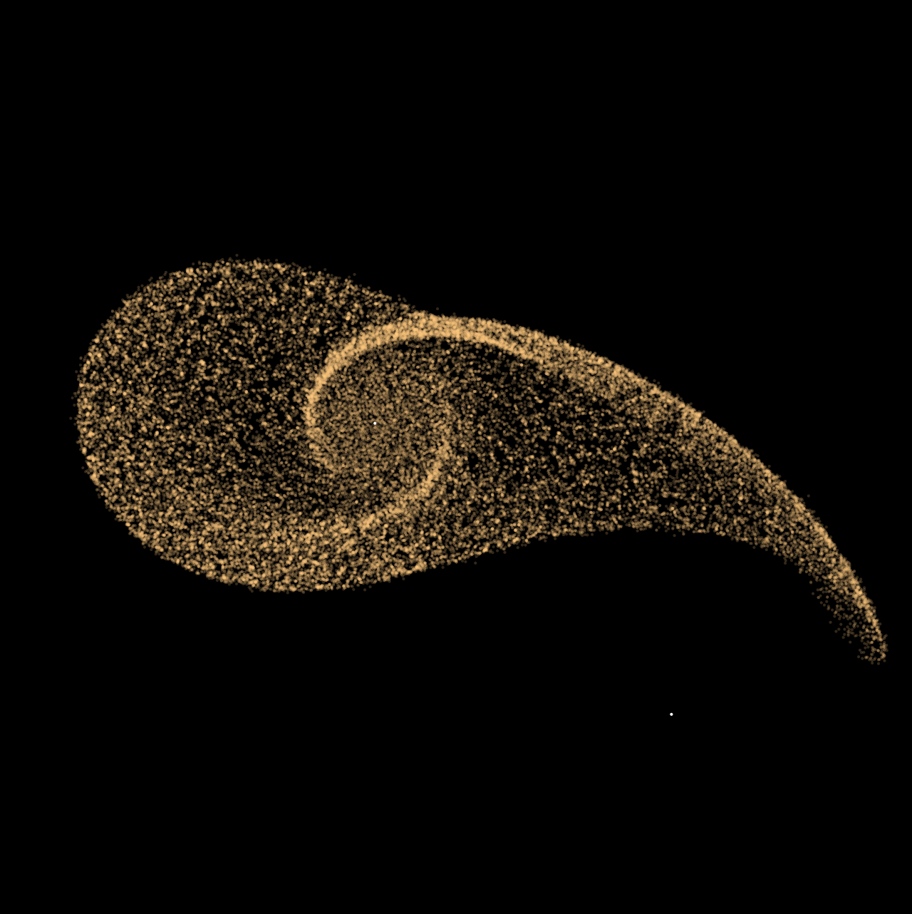
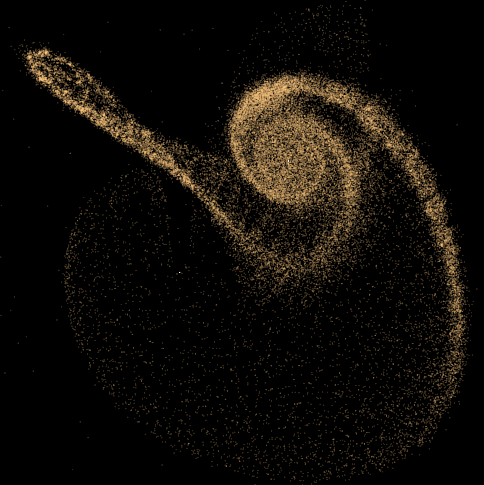
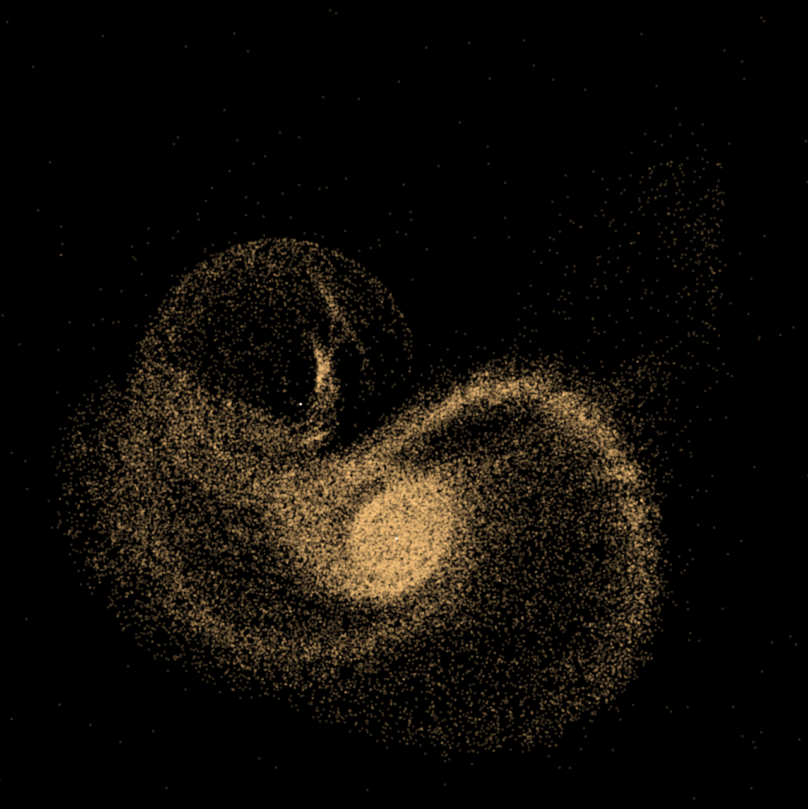

My daughter works on an n-body simulation in python
and so over the weekend I got interested in efficient 
implementations for it (in 2d). This is my approach to the 
Barnes Hut Algorithm. Runs good for 10000 particles
and it is also usable for 100.000 (all on the MacBook Air
M1 first gen).

Some comments: Recalibrating the tree is done
on the fly - when particles are moved outside of
their node, they are returned to the caller
(because they might be inserted close by most likely).

If dt is too big for close points, particles tend
to 'overshoot' and escape at vast speeds. In reality
they would most likely collide.

What I do, is, that very physically incorrect
I limit the force st the change in velocity 
does not exceed a certain threshold that depends
on the distance (I think in this commit it is 2*distance).

The simulation in these screenshots uses 100.000 particle
and it creates around 10 images per second.

These images are drawn using tornadofx, Kotlin's
JavaFX implementation. I like it, smooth and
straight forward.

Thanks goes out to ChatGPT who helped a lot with
formulas and syntax.

In MainView the universe that is simulated is hardcoded.
There are some samples in the Universe-Companion-object.

